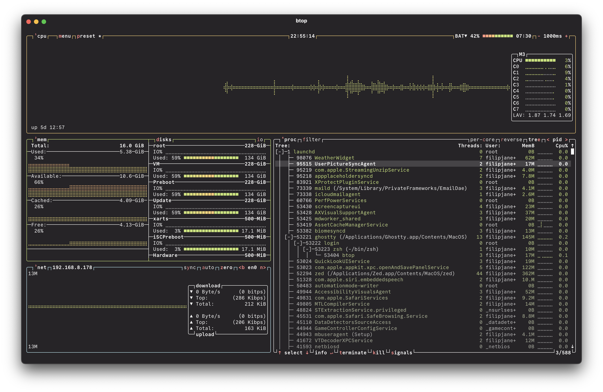

# 0x96f theme for btop

A simple and pleasant dark theme for [btop](https://zed.dev).

## Screenshots

## Install

- Copy the `themes/0x96f.theme` file from this repo into `~/.config/btop/themes`.
- Select your 0x96f theme in btop.
